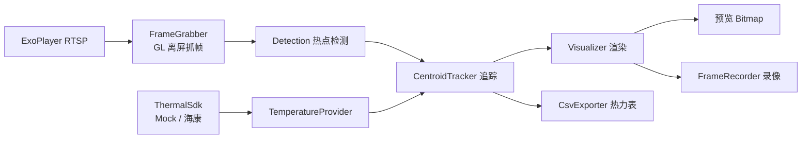

# 海康热成像 安卓版（ThermalTracker for Android）

由Python 工程（`thermal_tracker/`）移植的原生安卓应用骨架：
**Kotlin + Jetpack Compose + OpenCV for Android + Media3(ExoPlayer) + 海康安卓 SDK（待接入）**。

功能对齐 PC 版：

- RTSP 实时画面（TCP 传输，ExoPlayer 解码 + 断线自动重连）
- 热点检测（自适应阈值/固定阈值、形态学、轮廓、IoU 合并）
- 质心追踪（速度预测 + 贪心匹配，稳定 ID + 轨迹）
- 伪彩配色：铁虹 ironbow / 白热 whitehot / inferno / jet
- 温度显示：SDK 温度矩阵（真实测温）优先，灰度标定回退（默认 -20~150℃）
- SDK 调焦：自动 / 手动 / 半自动 + 按住连续调近/调远
- 截图（PNG）/ 录像（H.264 MP4）
- **CSV 热力表格导出**：热区表 或 全屏温度矩阵，采样周期 0.05s~5s 可调

## 目录结构

```
thermal_tracker_android/
├── settings.gradle.kts / build.gradle.kts / gradle.properties
├── gradle/libs.versions.toml          # 依赖版本
└── app/src/main/
    ├── AndroidManifest.xml
    ├── java/com/thermal/tracker/
    │   ├── MainActivity.kt            # 入口 + OpenCV 初始化 + 页面切换
    │   ├── model/                     # AppConfig / Hotspot / Track
    │   ├── processing/                # Detection / Tracker / Visualizer / TempCalibration（Python 移植）
    │   ├── camera/                    # RtspStream + FrameGrabber(GL 帧抓取)
    │   ├── hik/                       # ThermalSdk 接口 + Mock + HikSdkNative(占位)
    │   ├── data/                      # TemperatureProvider / CsvExporter / FrameRecorder
    │   ├── viewmodel/LiveViewModel.kt # 处理管线（取流→检测→追踪→渲染→导出）
    │   └── ui/                        # ConnectScreen / LiveScreen / Theme
    └── res/
```

## 环境要求

- Android Studio（Ladybug 或更新）
- JDK 17
- Android SDK 35（`compileSdk = 35`）
- 真机（RTSP 需要局域网访问相机）

## 构建运行

1. 用 Android Studio 打开 `thermal_tracker_android/` 文件夹
2. 首次会提示下载 Gradle 8.9 与依赖（Media3 / OpenCV 4.9.0 等），等待同步完成
3. 连上手机（或模拟器，模拟器访问局域网相机需同一网段）点 Run

> 命令行构建（可选）：
> ```
> cd thermal_tracker_android
> gradle wrapper        # 生成 gradlew（已含 wrapper 配置）
> .\gradlew.bat assembleDebug
> ```

## 使用

1. 连接页输入相机 IP / RTSP 端口 / 账号 / 密码 / 通道号（热成像主码流默认 `101`），点「连接」
2. 直播页：
   - 顶栏显示 FPS、热区数、温度量程
   - 「配色」切换伪彩；「自动对焦 / 手动」切换聚焦模式；「调近/调远」按住连续调焦
   - 「截图」存 PNG；「开始录像」存 MP4（再点停止）
   - CSV：拖动滑块选采样周期（0.05s~5s），切换「热区表/全矩阵」模式，打开开关开始采集
3. 输出文件位置（App 外部私有目录，USB 或 `adb pull` 取出）：

```
/sdcard/Android/data/com.thermal.tracker/files/
├── screenshots/   # 截图
├── recordings/    # 录像
└── thermal_csv/   # CSV 热力表格
```

## CSV 格式

**热区表模式**（每个采样点每个热区一行）：

```
time_ms,elapsed_s,track_id,x,y,w,h,area_px,peak_gray,mean_gray,peak_c,mean_c
1789000000123,0.500,3,120,80,34,28,612.0,242,226.55,132.4,124.1
```

**全矩阵模式**（每个采样点每像素一行，可按需降低采样或增大降采样）：

```
time_ms,elapsed_s,row,col,temp_c
1789000000123,0.500,0,0,18.7
```

> 全矩阵在 0.05s 周期下数据量很大（384×288 全量约 2.2M 行/秒），
> 建议用「热区表」模式或调大采样周期；全矩阵模式内置降采样参数
> `CsvConfig.matrixDownsample`（默认 2，即每 2 像素采一个）。

## 架构



处理管线跑在独立 `HandlerThread` 上（`LiveViewModel.processingLoop`），不阻塞 UI。

## Python 模块 → Kotlin 对照

| Python（PC 版） | Kotlin（安卓版） |
|---|---|
| `camera.py` | `camera/RtspStream.kt` + `camera/FrameGrabber.kt` |
| `detection.py` | `processing/Detection.kt` |
| `tracker.py` | `processing/Tracker.kt` + `model/Track.kt` |
| `visualizer.py` | `processing/Visualizer.kt` |
| `temp_calib.py` | `processing/TempCalibration.kt` |
| `hik_sdk.py` | `hik/ThermalSdk.kt`（实现待接入） |
| `gui_worker.py` | `viewmodel/LiveViewModel.kt` |
| `gui_main.py` | `ui/ConnectScreen.kt` + `ui/LiveScreen.kt` |
| （新增） | `data/CsvExporter.kt` / `data/FrameRecorder.kt` |

## 接入海康安卓 SDK（真实测温 + 调焦）

当前 `LiveViewModel` 默认用 `MockThermalSdk`（模拟温度矩阵），便于无相机开发。
接入真实 SDK 步骤：

1. 从海康官网（或开发者文档）下载 **HCNetSDK for Android**，获取
   `HCNetSDK.jar` 和 `libHCNetSDK.so`（含 arm64-v8a 等 ABI）
2. `HCNetSDK.jar` 放入 `app/libs/`，在 `app/build.gradle.kts` 取消注释
   `implementation(files("libs/HCNetSDK.jar"))`
3. `libHCNetSDK.so` 及其依赖 so 放入 `app/src/main/jniLibs/<abi>/`
4. 在 `hik/HikSdkNative.kt` 中实现：
   - `NET_DVR_Init` / `NET_DVR_Login_V40`（登录）
   - `NET_DVR_GET/SET_FOCUSMODECFG` + `NET_DVR_PTZControl(FOCUS_NEAR/FAR)`（调焦）
   - `NET_DVR_CaptureJPEGPicture_WithAppendData` 抓拍，解析 JPEG 附加数据段的全屏温度矩阵
     （解析算法参考 PC 版 `hik_sdk.py` 的 `capture_with_temperature()`）
5. 在 `LiveViewModel.connect()` 里把 `MockThermalSdk(...)` 换成 `HikSdkNative(...)`

> 权限：SDK 若需要写外部存储等权限，在 `AndroidManifest.xml` 补充声明。

## 已知限制 / 后续优化

- `FrameRecorder` 为骨架级实现（固定帧率/码率），需要更高质量录像可改用
  MediaCodec 输入 Surface + GL 渲染路径
- 帧抓取假设码流分辨率与 `CameraConfig.frameWidth/Height`（384×288）一致
- 全矩阵 CSV 数据量大，必要时增加降采样或改二进制格式
- 录像 MP4 当前为横屏（无旋转元数据）
